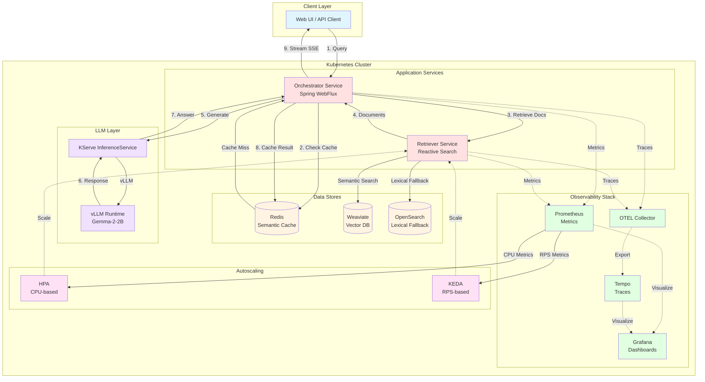

# Building Scalable RAG Pipelines with Java & Kubernetes

This repository contains the full conference demo for "Building Scalable RAG Pipelines with Java & Kubernetes." It showcases a production-inspired Retrieval Augmented Generation (RAG) stack written in Java 25 with Spring Boot 3.5.7 and deployed to Kubernetes (KinD locally, GKE in the cloud).

## Architecture



### Request Flow

1. **Client Request**: User sends query via Web UI or API
2. **Semantic Cache Check**: Orchestrator checks Redis for similar cached queries (cosine similarity > 0.90)
3. **Document Retrieval**: On cache miss, Retriever searches Weaviate (vector) with OpenSearch fallback (lexical)
4. **Context Assembly**: Retrieved documents are formatted into prompt context
5. **LLM Generation**: KServe routes to vLLM (Gemma-2-2B) for answer generation
6. **Response Streaming**: Answer streamed back via Server-Sent Events (SSE)
7. **Cache Update**: Result cached in Redis for future similar queries
8. **Observability**: OpenTelemetry traces and Prometheus metrics captured throughout

### Key Components

- **Orchestrator**: Coordinates caching, retrieval, and generation with graceful degradation
- **Retriever**: Provides hybrid search (vector + lexical) with automatic fallback
- **Semantic Cache**: Redis-backed similarity matching reduces redundant LLM calls
- **LLM Tiering**: KServe + vLLM with template-based fallback when model unavailable
- **Autoscaling**: HPA (CPU) + KEDA (RPS) dynamically scale retriever pods (2-30 replicas)

## Highlights

- **Service boundaries:** Independent `retriever` and `orchestrator` services with a shared `common` module for DTOs and tracing utilities.
- **Vector + lexical retrieval:** Weaviate provides semantic search while OpenSearch delivers graceful lexical fallbacks.
- **Semantic cache:** Redis-backed cosine similarity cache avoids redundant generations.
- **LLM tiering:** KServe + vLLM host the primary model; deterministic templates provide graceful degradation when the model is offline.
- **Streaming UX:** Server-Sent Events (SSE) stream tokens and final citations to the client.
- **Observability:** OpenTelemetry traces, Prometheus metrics, Grafana dashboards, and Tempo integration out of the box.
- **Autoscaling:** Horizontal Pod Autoscaler (CPU) plus KEDA (Prometheus RPS trigger) scale the retriever under load.

## Repository Layout

```
common/                # Shared DTOs and tracing helpers
retriever/             # Reactive Weaviate/OpenSearch retriever service
orchestrator/          # Orchestration, caching, LLM routing, SSE
data/                  # Sample documents and ingestion scripts
deploy/                # Kubernetes manifests for apps and observability stack
scripts/               # Cluster bootstrap and load testing tools
Makefile               # Build, deploy, ingest, and teardown helpers
```

## Prerequisites

- Java 25 and Maven (the Maven wrapper downloads dependencies automatically)
- `kubectl` v1.28+
- `gcloud` CLI (for GKE deployment)
- Docker or container runtime (optional, for local KinD development)
- `kind` v0.20+ (optional, for local development)
- Optional: `helm`, `k6` for load testing

## Configuration

All deployment configuration is managed through a `.env` file that the Makefile reads automatically:

1. **Copy the example configuration:**
   ```bash
   cp .env.example .env
   ```

2. **Edit `.env` with your GCP project and preferences:**
   ```bash
   vim .env  # or your preferred editor
   ```

3. **The Makefile handles everything else** - all `make` commands will use your `.env` settings

**Note**: The `.env` file is git-ignored to protect your credentials.

### Recommended Regions & GPUs

| Region | GPU Type | Machine Type | Availability | Best For |
|--------|----------|--------------|--------------|----------|
| europe-west4 | L4 | g2-standard-4 | ⭐⭐⭐ Excellent | EU deployment, cost-effective |
| us-central1 | L4 | g2-standard-4 | ⭐⭐ Good | US deployment, cost-effective |
| europe-north1 | H100 | a3-highgpu-1g | ⭐ Limited | High-end workloads |

## Quickstart (Local KinD)

1. **Bootstrap dependencies and cluster:**
   ```bash
   make dev-up
   ```
   This script creates a KinD cluster, installs cert-manager, KServe CRDs, KEDA, and applies base namespaces/config.

2. **Build images (pushed to Artifact Registry by default):**
   ```bash
   make build
   ```
   This publishes both service images to `europe-north1-docker.pkg.dev/mohamed-playground/rag-demo`. Override with `REGISTRY=my-registry make build`. Make sure `gcloud auth configure-docker europe-north1-docker.pkg.dev` (or an equivalent registry credential) is configured so the build can push and the cluster can pull.
   Need a local-only build? Use `make build-local` to load the images into your Docker daemon instead of pushing.

3. **Deploy runtime components:**
   ```bash
   make deploy
   ```
   Applies Weaviate, Redis, optional OpenSearch, KServe vLLM runtime, retriever, orchestrator, autoscalers, and observability stack (Prometheus, Tempo, Grafana, OTEL Collector).
   If your cluster needs credentials to pull from Artifact Registry, create an image pull secret first (e.g. `gcloud auth configure-docker` or `kubectl create secret docker-registry ...`) and add it to the `retriever` and `orchestrator` Deployments.

4. **Ingest sample documents:**
   ```bash
   make ingest
   ```
   A Kubernetes Job runs `data/ingest/ingest.py`, creates the Weaviate schema, chunks the docs, and upserts deterministic embeddings.

5. **Port-forward services:**
   ```bash
   make port-forward
   ```
   - Orchestrator: http://localhost:8080
   - Grafana: http://localhost:3000 (admin/admin)

6. **Call the API:**
   ```bash
   curl -s http://localhost:8080/v1/ask \
     -H 'Content-Type: application/json' \
     -d '{"prompt":"How does autoscaling work?","topK":5}' | jq
   ```

7. **Run the streaming endpoint:**
   ```bash
   curl -N "http://localhost:8080/v1/ask/stream?prompt=Explain+our+telemetry"
   ```

8. **Load test (optional):**
   ```bash
   k6 run scripts/loadtest-k6.js
   ```
   The script drives 10→30 RPS and surfaces autoscaling behaviour in Grafana.

9. **Tear down:**
   ```bash
   make down
   make dev-down   # deletes the KinD cluster
   ```

## Deploying to GKE

### Quick Start

```bash
# 1. Configure your environment
cp .env.example .env
vim .env  # Set GCP_PROJECT, GKE_REGION, and REGISTRY

# 2. Create GKE cluster
make gke-cluster

# 3. Install KServe
kubectl apply -f https://github.com/cert-manager/cert-manager/releases/download/v1.13.0/cert-manager.yaml
kubectl wait --for=condition=available --timeout=300s deployment/cert-manager-webhook -n cert-manager
kubectl apply -f https://github.com/knative/serving/releases/download/knative-v1.12.0/serving-crds.yaml
kubectl apply -f https://github.com/knative/serving/releases/download/knative-v1.12.0/serving-core.yaml
kubectl apply -f https://github.com/knative/net-kourier/releases/download/knative-v1.12.0/kourier.yaml
kubectl patch configmap/config-network --namespace knative-serving --type merge \
  --patch '{"data":{"ingress-class":"kourier.ingress.networking.knative.dev"}}'
kubectl apply -f https://github.com/kserve/kserve/releases/download/v0.12.0/kserve.yaml
kubectl wait --for=condition=available --timeout=300s deployment/kserve-controller-manager -n kserve
sleep 10
kubectl apply -f https://github.com/kserve/kserve/releases/download/v0.12.0/kserve-cluster-resources.yaml
kubectl patch configmap/inferenceservice-config -n kserve --type merge \
  --patch '{"data":{"deploy":"{\"defaultDeploymentMode\":\"RawDeployment\"}"}}'

# 4. Create GPU node pool
make gke-gpu

# 5. Build and push images
gcloud auth configure-docker europe-north1-docker.pkg.dev
make build

# 6. Deploy all services
make gke-deploy

# 7. Ingest sample data
make ingest

# 8. Access the application
kubectl get svc orchestrator-public -n rag  # Get external IP
```

### Makefile Targets

All deployment is controlled via `make` commands that read your `.env` configuration:

| Command | Description |
|---------|-------------|
| `make gke-cluster` | Create GKE cluster with your configured region |
| `make gke-gpu` | Create GPU node pool (L4 or H100 based on config) |
| `make gke-credentials` | Get cluster credentials |
| `make build` | Build and push images to your registry |
| `make gke-deploy` | Deploy all services + LoadBalancer |
| `make deploy` | Deploy services only (no LoadBalancer) |
| `make ingest` | Run data ingestion job |
| `make down` | Delete all deployed resources |
| `make help` | Show all available commands |

### Install KServe (One-Time Setup)

KServe installation is currently manual. Run these commands after `make gke-cluster`:

```bash
# Install cert-manager
kubectl apply -f https://github.com/cert-manager/cert-manager/releases/download/v1.13.0/cert-manager.yaml
kubectl wait --for=condition=available --timeout=300s deployment/cert-manager-webhook -n cert-manager

# Install Knative Serving
kubectl apply -f https://github.com/knative/serving/releases/download/knative-v1.12.0/serving-crds.yaml
kubectl apply -f https://github.com/knative/serving/releases/download/knative-v1.12.0/serving-core.yaml

# Install Kourier networking layer
kubectl apply -f https://github.com/knative/net-kourier/releases/download/knative-v1.12.0/kourier.yaml
kubectl patch configmap/config-network \
  --namespace knative-serving \
  --type merge \
  --patch '{"data":{"ingress-class":"kourier.ingress.networking.knative.dev"}}'

# Install KServe
kubectl apply -f https://github.com/kserve/kserve/releases/download/v0.12.0/kserve.yaml
kubectl wait --for=condition=available --timeout=300s deployment/kserve-controller-manager -n kserve
sleep 10
kubectl apply -f https://github.com/kserve/kserve/releases/download/v0.12.0/kserve-cluster-resources.yaml
```

### 11. Deploy LLM Service (Requires GPU)

```bash
# Deploy vLLM runtime for KServe
kubectl apply -f deploy/vllm-runtime.yaml

# Deploy Gemma 2 model with vLLM (only if you created GPU node pool)
kubectl apply -f deploy/kserve-vllm.yaml

# Monitor the deployment (it will auto-scale from 0 when first request arrives)
kubectl get inferenceservice -n rag
```

### 11. Expose Orchestrator Publicly

```bash
# Deploy LoadBalancer service for external access
kubectl apply -f deploy/orchestrator-gke.yaml

# Get external IP (may take a few minutes)
kubectl get svc orchestrator-public -n rag
```

### 12. Access the Application

Once the LoadBalancer has an external IP:

```bash
# Get the external IP
EXTERNAL_IP=$(kubectl get svc orchestrator-public -n rag -o jsonpath='{.status.loadBalancer.ingress[0].ip}')

# Open the UI in browser
open http://$EXTERNAL_IP

# Or test the API
curl http://$EXTERNAL_IP/v1/ask \
  -H 'Content-Type: application/json' \
  -d '{"prompt":"What is RAG?","topK":5}'
```

### Cleanup

```bash
# Delete all resources
kubectl delete -f deploy/

# Delete cluster
gcloud container clusters delete rag-demo \
  --region=europe-west4 \
  --project=mohamed-playground
```

## Web UI

The orchestrator includes an interactive web UI accessible at the root path (`/`). Features include:

- **Configuration Panel**: Set API endpoint, top-K results, enable/disable streaming, add metadata filters
- **Chat Interface**: Interactive conversation with real-time message streaming
- **Statistics Dashboard**: Total queries, average response time, last query metrics
- **Query History**: Last 10 queries (click to reuse)
- **Dark/Light Mode**: Toggle theme with persistent localStorage
- **Connection Testing**: Verify service health
- **Citations Display**: Sources shown as clickable tags
- **Response Metrics**: Time to first token, total tokens, partial/complete status

Access the UI at:
- Local (with port-forward): http://localhost:8080/
- GKE (after LoadBalancer): http://EXTERNAL_IP/

## Services & Contracts

- `POST /v1/retrieve` (retriever)
  - Request: `Query` record (`text`, optional `filters`, `topK`)
  - Response: `List<RetrievedDoc>`
- `POST /v1/ask` (orchestrator)
  - Request: `{ "prompt": "...", "filters": {...}, "topK": 8 }`
  - Response: `GenerationResponse` with answer, citations, and `partial` flag
- `GET /v1/ask/stream` (orchestrator)
  - Streams SSE `token` events followed by a `complete` event containing citations.

Both services expose `/actuator/health` and `/actuator/prometheus` for readiness and metrics.

## Testing

```bash
make test
```

Key test coverage:

- `common` module validation of tracing utilities.
- Retriever unit tests for fallback routing and Testcontainers-based Weaviate integration.
- Orchestrator tests for prompt assembly, cache thresholds, fallback routing, and Redis integration via Testcontainers.

CI runs the same test matrix via GitHub Actions (`.github/workflows/ci.yml`).

## Observability

- Grafana dashboards (ConfigMap `grafana-dashboard-rag`) visualize latency, cache hit ratio, fallback rate, token throughput, and estimated cost.
- Tempo receives OpenTelemetry traces; the Java agent is downloaded at pod startup and exports to the OTEL Collector.
- Prometheus scrapes annotated services and feeds both Grafana panels and the KEDA Prometheus scaler.

## Data & Ingestion

Sample documents live in `data/docs`. The ingestion script:

1. Waits for Weaviate readiness.
2. Creates the `Doc` schema (`docId`, `chunk`, `source`, `section`).
3. Chunks Markdown/text into ~900-character windows.
4. Generates deterministic embeddings (compatible with the in-app cache) and upserts via `/v1/objects`.

Re-run `make ingest` anytime to refresh content; IDs are deterministic.

## Troubleshooting

- Use the Grafana dashboard and Tempo traces to localize latency or fallback spikes.
- Inspect Weaviate readiness at `/v1/.well-known/ready` and Redis via `kubectl logs deploy/redis`.
- Force fallback behaviour by lowering `RETRIEVAL_TIMEOUT_MS` via the retriever ConfigMap.
- Additional tips are documented in `data/docs/doc-10-troubleshooting.md`.

## License

MIT – see [LICENSE](LICENSE).
